# Meraki Webhooks Webex Teams Connector
Meraki Webhooks Webex Teams Connector

This application is designed to simplify the integration and delivery of Meraki Webhooks into Webex Teams.

# Contents
- [Prerequisites](#prerequisites)
- [Meraki Integration](#meraki)
  - [Enable API Access](#meraki-api-access)
  - [Get API Token](#meraki-api-token)
  - [Get Organization ID](#meraki-org-id)
  - [Environment](#meraki-env-setup)
- [Application Installation](#installation)
  - [Heroku](#heroku-install)
  - [Install Locally](#local-install)
    - [ngrok](#ngrok)
    - [Source](#source-install)
    - [Docker](#docker-install)

# Prerequisites<a name="prerequisites"/>

If you don't already have a Webex Teams account, go ahead and register for one.  They are free.
You'll need to start by adding a new integration on the Webex Teams Developer site.

1. Navigate to https://developer.webex.com, and click "Log in" near the top right.

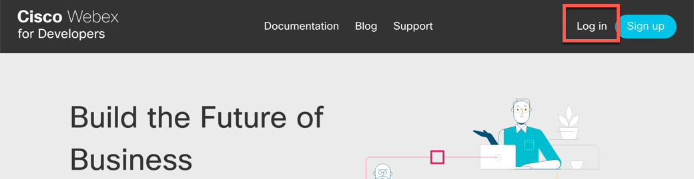

2. Log in to Webex using your credentials.

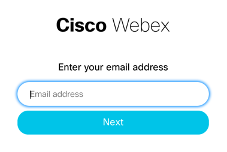

3. Click your profile picture at the top right, then select the "My Webex Teams Apps"

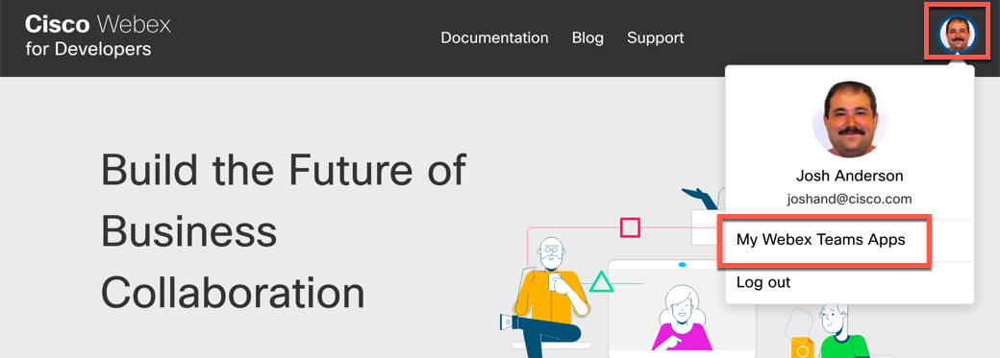

4. Click "Create an Integration"

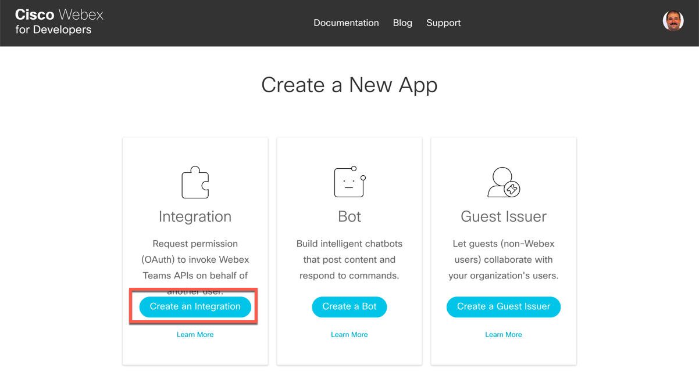

5. Provide a Name for the Integration, your e-mail address and choose or Upload an Icon to represent the integration.

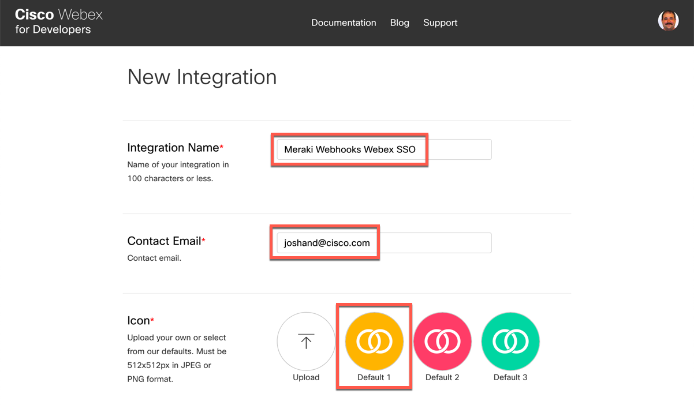

6. Enter a Description for the Integration. For the Redirect URI(s), enter the Public URL of your application, and append "/callback" to the end of it.

***Note: If you plan on deploying to Heroku, you should [start that process now](#heroku-install) so you can fill in variables as you go. Your Redirect URI for Heroku will be https://<your-app-name>.herokuapp.com/callback.***

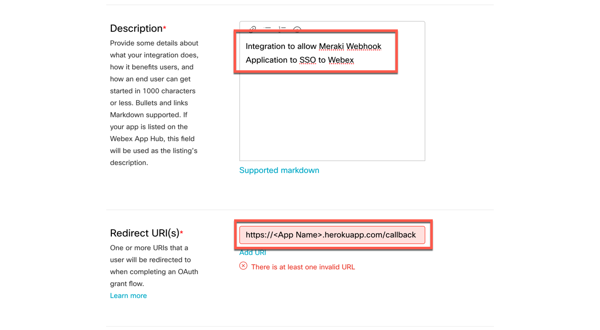

7. Select the Scopes for your Application. It requires the following scopes: "spark:rooms_read spark:rooms_write spark:memberships_read spark:memberships_write spark:people_read"

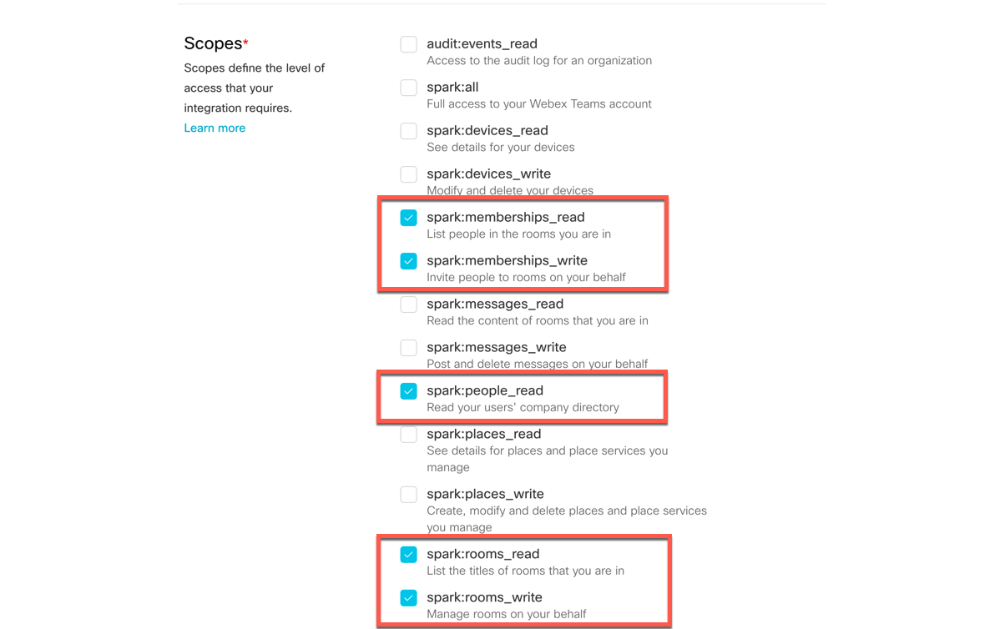

8. Click your profile picture again at the top right, then select the "My Webex Teams Apps"


9. Click "Create a Bot"

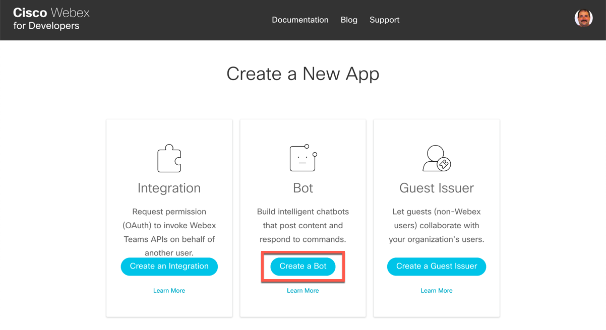

10. Provide a Name for the Bot, enter a Username and choose or Upload an Icon to represent the bot.

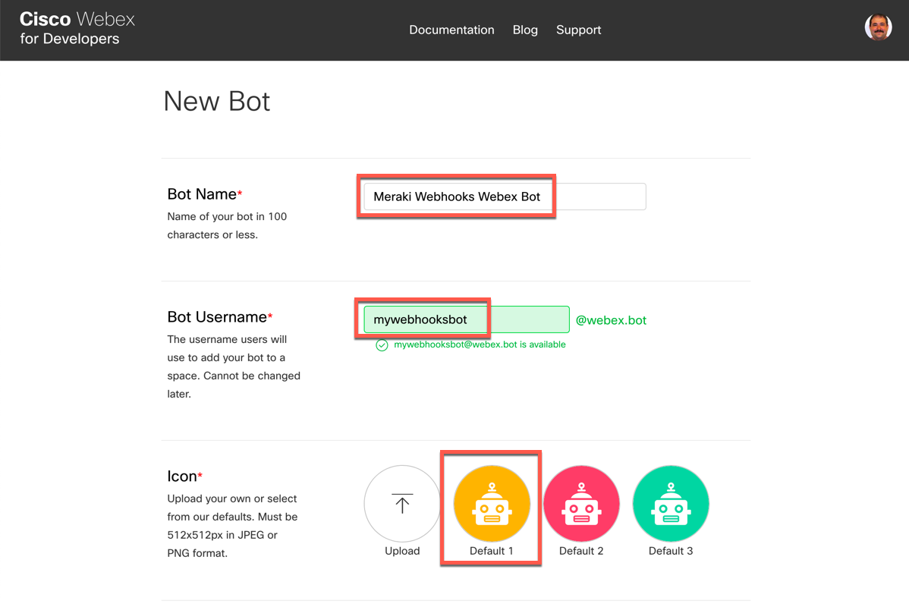

11. Enter a Description for the Bot.

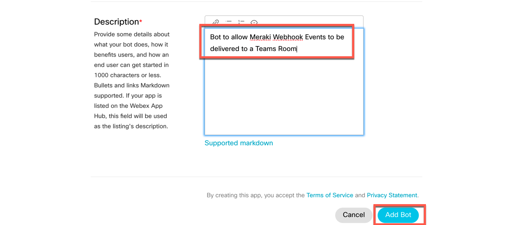

12. Copy and store your Access Token - you will need this for your application.

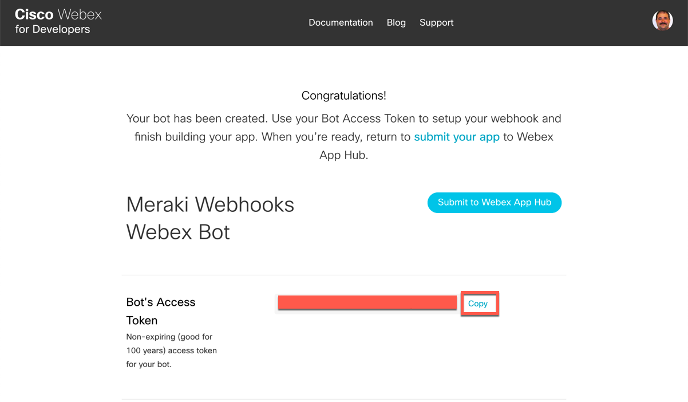

# Meraki Dashboard Configuration<a name="meraki"/>

---

## Enable your Meraki organization for API Access<a name="meraki-api-access"/>

1. Log in to the Meraki Dashboard. Choose your organization if prompted to do so.

2. On the left Navigation bar, go to Organization and select Settings.

3. Scroll down to the Dashboard API Access section, and turn on API Access.

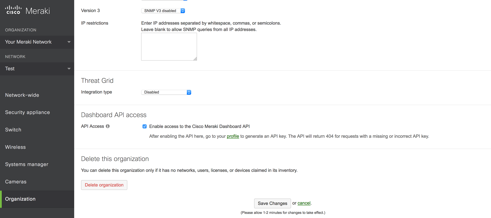

## Obtain your Meraki API Token<a name="meraki-api-token"/>

1. Log in to the Meraki Dashboard. Choose your organization if prompted to do so.

2. Under your username, select My profile

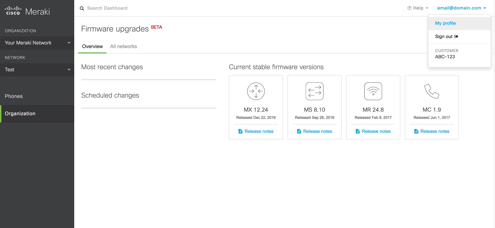

3. Scroll down to the API access section, and create an API key. You'll need it to get your Organization ID and to set your environment variables.

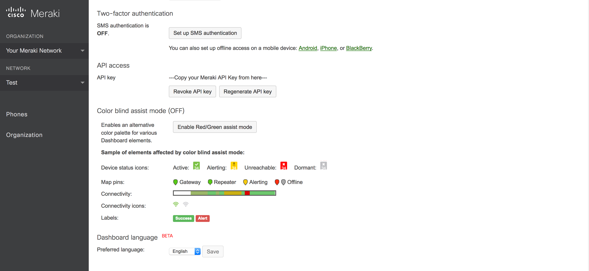

# Application Installation<a name="installation"/>

Heroku Installation is the recommended method. However, instructions are below for local installation if you prefer to run it in your private environment.

## Cloud Installation - Heroku<a name="heroku-install">

[](https://heroku.com/deploy)

## Local Installation<a name="local-install"/>

### ngrok - Skip this step if you already have an Internet reachable web-server<a name="ngrok"/>

ngrok will make easy for you to develop your code with a live bot.

If you are running a Mac with Homebrew, you can easily install via "brew cask install ngrok". Additional installation instructions can be found here: https://ngrok.com/download

After you've installed ngrok, in another window start the service


`ngrok http 5000`


You should see a screen that looks like this:

```
ngrok by @inconshreveable                                                                                                                                 (Ctrl+C to quit)

Session Status                online
Version                       2.2.4
Region                        United States (us)
Web Interface                 http://127.0.0.1:4040
Forwarding                    http://this.is.the.url.you.need -> localhost:5000
Forwarding                    **https://this.is.the.url.you.need** -> localhost:5000

Connections                   ttl     opn     rt1     rt5     p50     p90
                              2       0       0.00    0.00    0.77    1.16

HTTP Requests
-------------

POST /                         200 OK
```

### Source<a name="source-install">

Create a virtualenv and install the module

```
virtualenv venv
source venv/bin/activate
pip install -r requirements.txt
git clone https://github.com/meraki/spark-operations-bot.git
```

The easiest way to use this module is to set a few environment variables. On Windows, use "set" instead of "export". See the ngrok section below if you do not have a web server already facing the Internet. These are the Environment variables that are required to run the application (app.py):

```
export WEBEX_INTEGRATION_CLIENT_ID=<The Client ID of the Integration that you create in Webex Teams. Create a new Integration at https://developer.webex.com/my-apps/new/integration if you have not already done so.>
export WEBEX_INTEGRATION_CLIENT_SECRET=<The Client Secret of the Integration that you create in Webex Teams.>
export WEBEX_BOT_USERNAME=<The Username of the Bot that you create in Webex Teams. Create a new Bot at https://developer.webex.com/my-apps/new/bot if you have not already done so.>
export WEBEX_BOT_TOKEN=<The Token of the Bot that you create in Webex Teams.>
export BASE_URL=<The base address of your application. The public address of your Heroku app will be 'https://<App Name>.herokuapp.com/>
```

Now launch your bot!!

`python app.py`

### Docker<a name="docker-install">

First, make a copy of the .env.sample file, naming it .env, and editing it to set your environment variables.

Then build the container:
```
docker build -t joshand/meraki-webhooks-teams .
docker run -p 5000:5000 -it --env-file .env joshand/meraki-webhooks-teams
```
